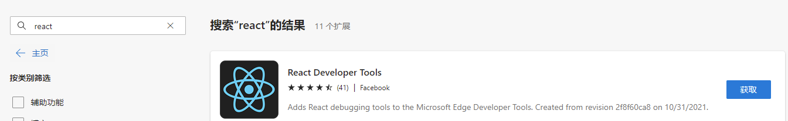

# Reacts

[toc]

## P01-React 简介

[入门教程: 认识 React – React (docschina.org)](https://react.docschina.org/tutorial/tutorial.html)

1.什么是react？

> React是用于构建用户界面的 JavaScript库。

2.谁开发的？

> 由Facebook开发。

3.为什么要学习？

> 原生的 JavaScript 操作DOM繁琐，效率低。
> 使用 JavaScript 直接操作DOM，浏览器会进行大量的重绘重排。
> 原生的 JavaScript 没有组件化编码方案，代码复用效率低。

4.React 特点

> 采用组件化模式，声明式编码，提高开发效率以及组件复用率。
> 在React Native中可以使用React语法进行移动端开发。
> 使用虚拟DOM+优秀的Diffing算法，尽量减少真是的DOM交互。

## P02-Hello React入门案例

引入React库，顺序不能改变

~~~react
<!-- react 核心库 -->

<!-- react-dom 用于支持react操作DOM -->

<!-- babel 用于将JSX转为>JS -->

~~~

## P03-使用react开发者调试工具

> 在Edge或者Google浏览器的扩展插件里面搜索react
>
> 选择Facebook出品的扩展程序添加到浏览器里面

## P04-模块与组件、模块化与组件化的理解

**模块**

1.理解：向外提供特定功能的js程序，一般就是一个js文件。
2.为什么要拆模块：随着业务逻辑的增加，代码多且复杂。
3.作用：服用js，简化js的编写，提高js运行效率。

**组件**

1.理解：用来实现局部功能效果的代码和资源的合计（html/css/js/img）
2.为什么：一个界面的功能更复杂
3.作用：服用编码，简化项目编码，提供运行效率。

**模块化**

当应用的js都以模块来编写，这个应用就是一个模块化应用。

**组件化**

当应用是以多组件的方式实现，这个应用就是一个组件化的应用。

## P04-React 面向组件编程

